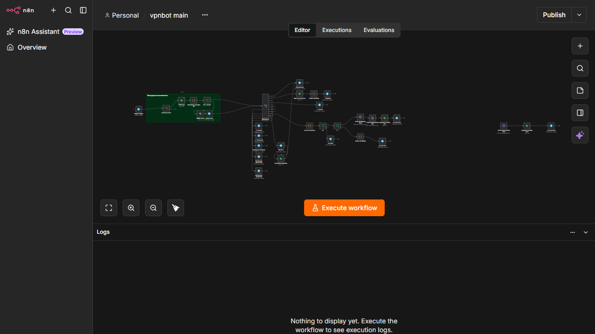
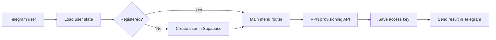

# VPN Telegram Bot

## Overview

A Telegram-based self-service flow for onboarding users, checking account state, provisioning VPN access through external APIs, storing access data, and returning the result to the user.

## Architecture

Telegram Trigger -> user lookup -> registration/state checks -> menu router -> selected operation -> VPN API -> Supabase -> Telegram response

## Main integrations

- Telegram Bot API
- Supabase
- Marzban API
- Amnezia API
- n8n HTTP Request, IF, Switch, Code, and Telegram nodes

## Capabilities

- Product-like workflow design rather than a single linear automation
- Stateful user journeys and database-backed decisions
- Multi-branch routing for profile, setup, payment, email, and instructions
- External API orchestration and persistence of generated access keys
- Separation of user-facing actions from backend provisioning steps

## Production improvements

- Add explicit error branches and retries for every external API call
- Make provisioning idempotent so repeated Telegram events cannot create duplicates
- Add structured execution logging and correlation IDs
- Store secrets only in n8n credentials and rotate API keys regularly
- Add subscription expiration, revocation, and audit workflows
- Add automated tests using a staging Telegram bot and VPN API

## Workflow

A user opens the bot, completes onboarding, chooses a device or access option, and receives a generated configuration without operator intervention.

## Security and deployment

Use mock credentials, test API URLs, and fake user data when deploying this public export.

## Workflow export

[Download the sanitized workflow](./workflow-sanitized.json)
