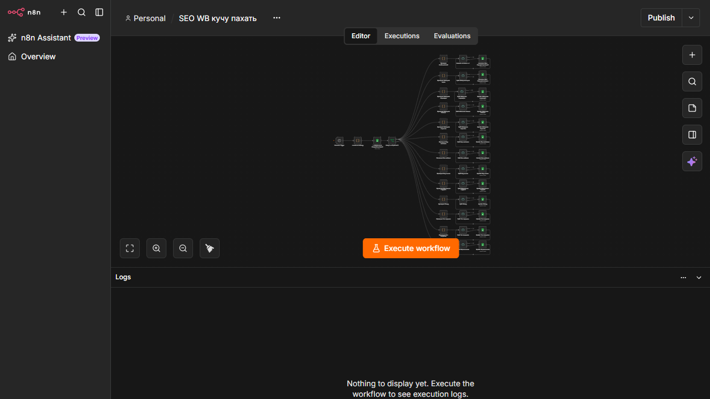

# Wildberries SEO Quality Pipeline

## Overview

A batch-processing system for checking and updating product metadata in Google Sheets. The workflow validates multiple product attributes, processes rows in batches, and writes status and corrections back to the operational sheet.

## Architecture

Schedule Trigger -> load working sheet -> filter rows by status -> validate product attributes -> batch updates -> write results back to Google Sheets

## Main integrations

- Google Sheets
- n8n Schedule Trigger
- Split In Batches
- IF and Code nodes
- JavaScript validation rules

## Capabilities

- Automation of a repetitive business operation
- Status-driven processing instead of blind rewriting
- Batch handling for larger product lists
- Multiple validation stages for product characteristics
- A workflow that can be measured by processed rows and manual hours saved

## Production improvements

- Extract shared validation logic into sub-workflows or reusable code
- Add a validation summary and failed-row report
- Add retry/backoff for Google Sheets rate limits
- Add a lock to prevent two scheduled runs from processing the same rows
- Add schema validation for input columns
- Record run ID, timestamp, and rule version in every updated row

## Workflow

A scheduled run finds products marked as in progress, checks selected SEO attributes, and updates only the relevant rows while preserving an audit-friendly status.

## Data and deployment

Use a fake spreadsheet with 10-20 sample rows. Never publish real product or client data.

## Workflow export

[Download the sanitized workflow](./workflow-sanitized.json)
