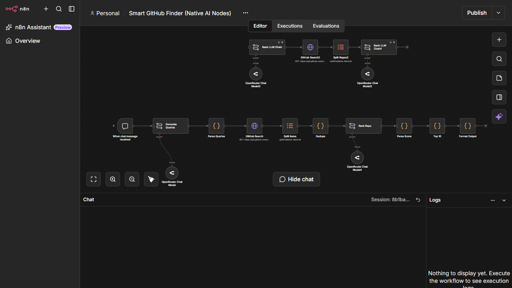

# Smart GitHub Finder

## Overview

An AI-assisted search workflow that turns a natural-language request into GitHub search queries, collects repositories, removes duplicates, scores candidates, ranks the results, and formats a shortlist for the user.

## Architecture

Chat Trigger -> LLM query generation -> parse queries -> GitHub search -> split items -> deduplicate -> LLM scoring -> parse scores -> top results -> formatted response

## Main integrations

- n8n Chat Trigger
- GitHub REST API
- OpenRouter LLM
- JavaScript parsing and ranking logic
- Deduplication and item processing nodes

## Capabilities

- AI used for a concrete research task
- A multi-stage pipeline with deterministic steps around the LLM
- Separation of generation, retrieval, scoring, and presentation
- Practical handling of duplicates and ranked output
- A clear user-facing search flow with explainable output

## Production improvements

- Add GitHub rate-limit handling and pagination
- Cache repeated searches
- Add a deterministic scoring baseline for comparison with the LLM
- Validate the model's score format with a strict schema
- Track search quality using a small labeled test set
- Show repository evidence for every ranking decision

## Workflow

The user asks for a type of repository in plain language. The workflow searches GitHub, evaluates the candidates, and returns a ranked shortlist with reasons.

## Security and deployment

Use a low-volume test token or public GitHub endpoints. Do not publish a personal GitHub token.

## Workflow export

[Download the sanitized workflow](./workflow-sanitized.json)
