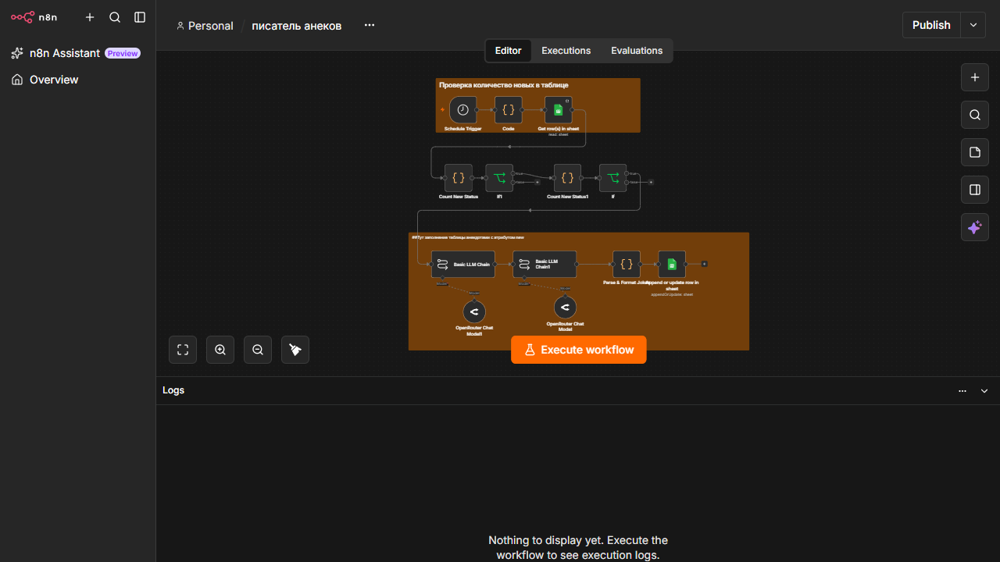
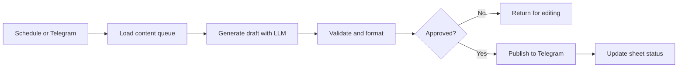

# AI Content Factory

## Overview

A set of connected workflows for generating, checking, approving, and publishing short-form content. The system uses Google Sheets as an operational queue and Telegram as an approval and publishing channel.

## Architecture

Schedule or Telegram input -> load queued items -> generate draft -> parse and validate -> approval/status branch -> publish to Telegram -> update the sheet

## Main integrations

- Telegram Bot API
- Google Sheets
- OpenRouter LLM
- n8n Schedule Trigger, Chat Trigger, Agent, LLM Chain, IF, Code, and batching nodes

## Capabilities

- End-to-end content operations rather than isolated text generation
- Human-in-the-loop approval logic
- Queue and status management through a spreadsheet
- Scheduled processing and publication flows
- Combination of deterministic validation with LLM generation

## Production improvements

- Add duplicate-content checks and a content fingerprint
- Add moderation and brand-safety rules before publishing
- Add a hard approval gate for external publishing
- Add retries, dead-letter status, and failure notifications
- Store prompt and model versions with every generated item
- Add analytics for published, rejected, and failed content

## Workflow

A queued content item is generated, checked, approved in Telegram, published, and marked with its final status in the operating sheet.

## Content and deployment

Use synthetic content and a test Telegram channel. Keep the approval safeguards enabled before external publishing.

## Workflow export

[Download the sanitized workflow](./workflow-sanitized.json)
