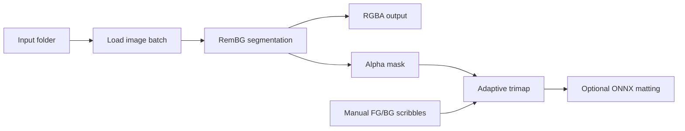
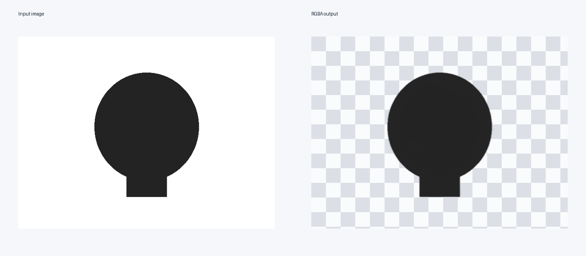

# RemBG Desktop Tool

A local Windows utility for removing image backgrounds from product photos. It combines a batch CLI, a lightweight annotation tool, adaptive trimap generation, and an optional ONNX matting hook.

The project also includes **RemBG Studio**, a desktop GUI for the v3 pipeline. It is designed for operators who prefer a visual workflow over terminal commands.

## What it does

- Removes backgrounds from JPG, PNG, WEBP, BMP, and TIFF images.
- Processes folders recursively and preserves the input directory structure.
- Saves RGBA PNG output and binary masks.
- Generates adaptive trimaps for difficult images.
- Supports manual foreground/background scribbles through a Tkinter annotator.
- Reuses a segmentation session across a batch for better throughput.
- Can use CPU inference and optionally detect CUDA/ONNX providers.

## Processing pipeline





## Components

| File | Purpose |
| --- | --- |
| `remove_bg.py` | Simple recursive background removal |
| `remove_bg_v2.py` | Batch processing with alpha refinement |
| `remove_bg_v3.py` | Quality-first pipeline with masks and trimaps |
| `gui_annotator.py` | Manual FG/BG annotation and reprocessing helper |
| `gui_frontend.py` | RemBG Studio desktop interface for selecting folders, processing images, viewing logs, and previewing output |
| `check_onnx.py` | Runtime and CPU/GPU provider diagnostics |
| `InspyrenetRembg.spec` | PyInstaller build configuration |

## Run locally

Create a virtual environment outside the repository and install the CPU dependencies:

```powershell
python -m venv .venv
.\.venv\Scripts\Activate.ps1
python -m pip install -r requirements-cpu.txt
```

Process a folder:

```powershell
python remove_bg_v3.py --input .\input-images --max-side 1600
```

Outputs are written next to the input folder:

- `<input>_v3_ready` for RGBA results
- `<input>_annotations` for trimaps and masks

Run the annotation helper:

```powershell
python gui_annotator.py
```

Run RemBG Studio:

```powershell
python gui_frontend.py
```

The interface provides:

- input and output folder selection;
- model selection;
- max-side, erosion, and dilation controls;
- background-removal progress log;
- output-folder shortcut;
- preview of the first processed image.

## Engineering notes

- The segmentation model is downloaded and cached on first use by `rembg`.
- CPU inference is the default portable path. CUDA requires a compatible NVIDIA runtime and provider.
- The ONNX matting hook is intentionally generic and should be validated against the selected model's input/output signature before production use.
- The GUI is designed for local desktop use, not as a public web service.

## Limitations and next steps

- Add a dedicated model adapter instead of relying on generic ONNX input heuristics.
- Add structured error reports for files that fail inside a batch.
- Add automated regression fixtures for hair, transparent objects, and low-contrast edges.
- Add a progress summary with processed, skipped, and failed counts.
- Package a tested Windows executable with a pinned model cache.
- Package `gui_frontend.py` as a Windows executable with PyInstaller for one-click use.

## License and model usage

Check the licenses and usage terms of `rembg`, its model weights, ONNX Runtime, and any optional matting model before redistribution.
